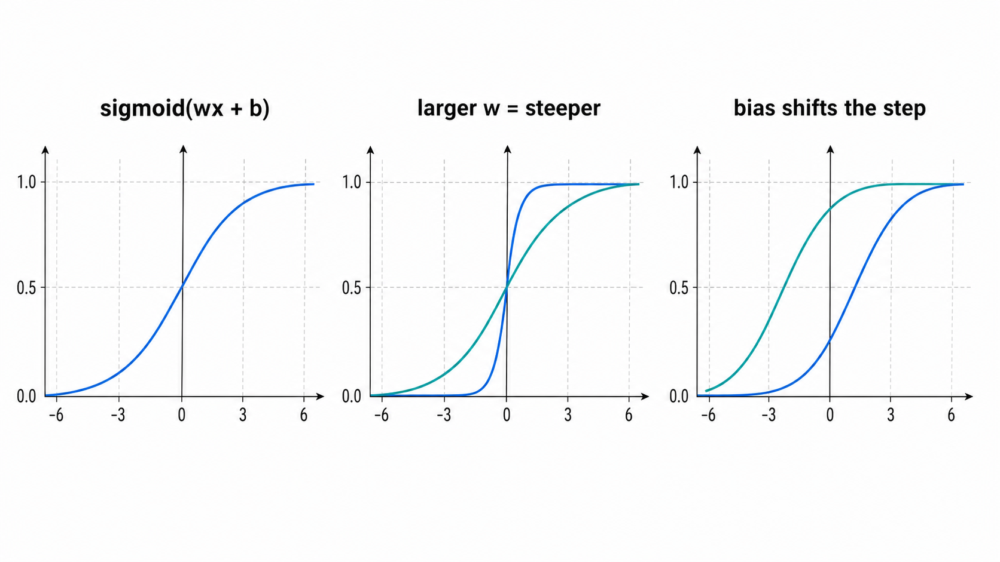
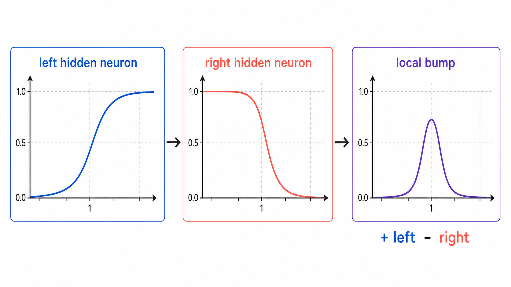
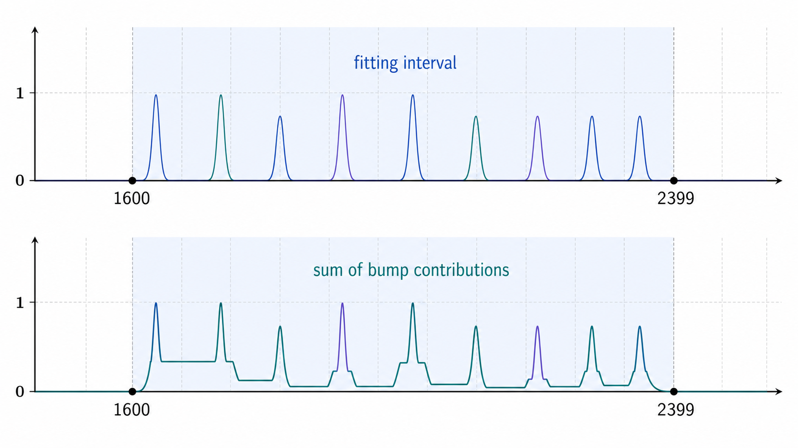

# Universal Approximation Demo: `is_leap_year`

这个小 demo 用一个简单的神经网络（1个输入层，1个隐藏层，1个输出层）来近似 `is_leap_year(year)`。

## 通用近似定理

维基百科的 [Universal approximation theorem](https://en.wikipedia.org/wiki/Universal_approximation_theorem)
页面把它概括为：某类神经网络函数族在它们要近似的更大函数空间中是稠密的。

更贴近神经网络的常见表述是：

> 对于定义在紧致集合上的任意连续函数，只要隐藏层神经元足够多，带有合适非线性激活函数的前馈神经网络，就可以把这个函数近似到任意精度。

这里有两个重要限制：

- 定理讨论的是连续函数，而 `is_leap_year` 是离散的 0/1 分类函数。
- 定理保证的是某个有限区域内的近似能力，不保证区间外自然外推。

那为什么还可以拿 `is_leap_year` 来演示？因为这里真正拟合的不是所有实数上的
闰年函数，而是有限多个整数点：

```text
1600, 1601, 1602, ..., 2399
```

在有限点集上，拟合问题会简单很多。我们只需要让网络在这些整数输入上输出正确的
0 或 1；至于整数之间的曲线长什么样，并不是 `is_leap_year` 本身关心的问题。

也可以换一个连续函数的视角来看：先构造一个连续的辅助函数，让它在每个闰年整数
附近有一个窄凸起，在普通年份附近接近 0。这个连续辅助函数在整数采样点上的值，
就和 `is_leap_year` 一致。神经网络近似的是这个带有很多窄凸起的连续函数，而我们
最后只在整数年份上读取它的输出。

如果从分类模型的角度说，也可以把网络输出解释成“输入年份是闰年的概率”或置信度。
这个概率函数是连续的：输入年份轻微变化时，sigmoid 网络的输出也会连续变化。
最终的 `True` / `False` 结果，是对这个连续分数做阈值判断：

```text
score >= 0.5 -> predict True
score <  0.5 -> predict False
```

所以本项目选择了一个有限拟合区间：

```text
1600 <= year < 2400
```

网络会在这个区间内把闰年点拟合出来。然而这个网络并不会真正学会 Gregorian 闰年规则及其 400 年周期，
因此在区间外的年份，模型的预测会明显失败。

## Sigmoid 神经元

每个隐藏层神经元都是标准形式：

```text
activation = sigmoid(weight * input + bias)
```

其中：

- `weight` 控制 sigmoid 曲线有多陡。
- `bias` 控制 sigmoid 曲线在 x 轴上的左右平移。



当 `weight` 很大时，sigmoid 会很像一个软阶跃函数。也就是说，它可以近似表示：

```text
x 小于某个边界时输出接近 0
x 大于某个边界时输出接近 1
```

而这个“边界”由 `bias` 决定。代码里把边界写成：

```python
sigmoid(k * (x - edge))
```

展开后就是：

```python
sigmoid(k * x - k * edge)
```

所以这个神经元的参数是：

```text
weight = k
bias   = -k * edge
```

## 两个神经元组成一个 bump

一个闰年点需要一个局部凸起。比如某个闰年是 `2000`，我们希望网络只在
`2000` 附近输出高值，在旁边年份输出低值。

代码会为每个闰年创建两个隐藏层神经元：

```text
left_step  = sigmoid(k * (x - left_edge))
right_step = sigmoid(k * (x - right_edge))
```

最终输出层神经元会接收所有隐藏层激活值。在它的加权求和部分，这两个隐藏激活
分别拿到一正一负的权重：

```text
+ output_slope * left_step
- output_slope * right_step
```

这一组的贡献就变成：

```text
output_slope * (left_step - right_step)
```

在 `left_edge` 和 `right_edge` 中间，`left_step` 接近 1，`right_step` 接近 0，
所以差值接近 1；在区间外，两个值会同时接近 0 或同时接近 1，所以差值接近 0。
这就形成了一个局部 bump。



## 多个 bump 拼出函数图像

在 `1600-2399` 内，每一个闰年都会得到这样一组两个隐藏神经元：

```text
一个闰年 -> 两个 hidden neurons -> 一个局部 bump
```

输出层把所有组的贡献加起来：

```text
z = output_bias + sum(each bump contribution)
score = sigmoid(z)
```

如果某一年命中了某个闰年 bump，`z` 会变大，最终 `score` 接近 1。
如果没有任何 bump 被命中，`z` 主要由负的 `output_bias` 决定，最终 `score` 接近 0。



## 运行

```bash
python3 leap_year_uat_demo.py
```

当前输出会展示：

- 若干样例年份的预测。
- 拟合区间外的预测。
- 网络结构和前 8 个隐藏层神经元的 `weight` / `bias`。
- 区间内和区间外准确率。

示例结果：

```text
Accuracy on fitted years 1600-2399: 800/800 = 100.0%
Accuracy outside fitted years 1200-1599 and 2400-2799: 606/800 = 75.8%
```

区间外准确率不是随机的 `50%`，而是接近“永远预测非闰年”的基线。因为模型在区间外
没有放置任何 bump，所以所有年份都会被预测为非润年。然而的确只有约 1/4 的年份是闰年，所以这样做的准确率也会有`~75%`。

## 结论

- 通用近似定理说明：只要神经元足够多，神经网络可以在给定的有限区间内，把目标函数近似得非常好。
- 但它是一个“存在性”结论：它说明某些权重和偏置可以做到近似，并不说明训练算法一定能找到这些参数，也不说明需要多少神经元、多少数据或多少训练时间。
- 它也不保证：模型真的学会了问题背后的规则，或者模型在拟合区间之外仍然可靠。
